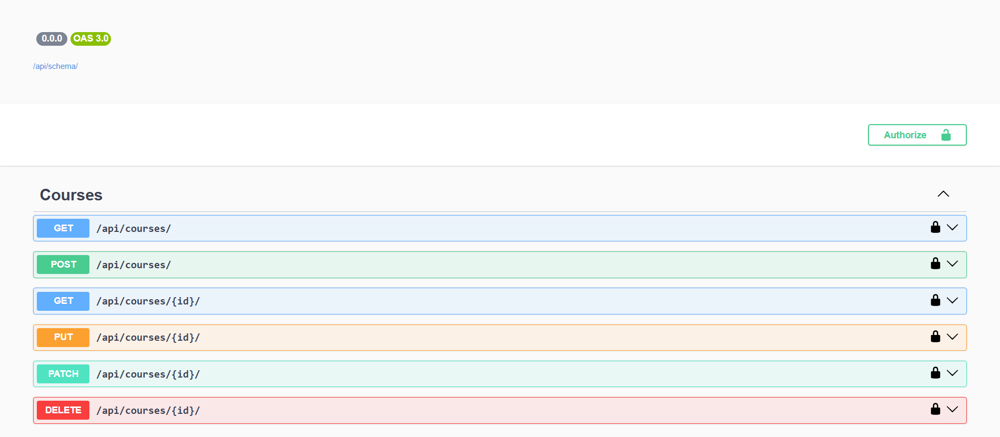

<div align="center">

# 🎓 Student Management System API

### 🚀 A Professional REST API built with Django REST Framework


---


</div>

---

# 📸 Project Screenshots

## Admin Panel


## Students Page


## Swagger API




# 📖 About

The **Student Management System API** is a backend project built using **Django REST Framework**.

It provides a secure and scalable REST API for managing:

- 👨‍🎓 Students
- 📚 Courses
- 📝 Enrollments

The project demonstrates real-world backend development practices including authentication, validation, filtering, pagination, and API documentation.

---

# ✨ Features

✅ Complete CRUD Operations

✅ JWT Authentication

✅ Protected API Endpoints

✅ Search Functionality

✅ Ordering

✅ Pagination

✅ Data Validation

✅ Filtering

✅ Swagger API Documentation

✅ Django Admin Panel

✅ RESTful Architecture

---

# 🛠 Tech Stack

| Technology | Usage |
|------------|-------|
| Python | Programming Language |
| Django | Backend Framework |
| Django REST Framework | REST APIs |
| SQLite | Database |
| JWT | Authentication |
| drf-spectacular | Swagger Documentation |
| Git & GitHub | Version Control |

---

# 📂 Project Structure

```
Student-Management-System
│
├── student_management/
├── students/
│   ├── models.py
│   ├── serializers.py
│   ├── views.py
│   ├── urls.py
│   └── admin.py
│
├── db.sqlite3
├── manage.py
└── README.md
```

---

# 🚀 API Endpoints

| Endpoint | Description |
|----------|-------------|
| `/api/students/` | Student CRUD |
| `/api/courses/` | Course CRUD |
| `/api/enrollments/` | Enrollment CRUD |
| `/api/token/` | Generate JWT Token |
| `/api/token/refresh/` | Refresh Token |
| `/api/docs/` | Swagger Documentation |

---

# 🔐 Authentication

This project uses **JWT (JSON Web Token)** authentication.

Protected endpoints require an **Access Token** generated after login.

---

# 📑 API Features

- 🔍 Search
- 📄 Pagination
- 🔃 Ordering
- 🎯 Filtering
- ✅ Validation
- 🔐 Authentication
- 📚 Swagger Documentation

---

# ⚡ Installation

```bash
git clone https://github.com/your-username/Student-Management-System.git

cd Student-Management-System

python -m venv venv

venv\Scripts\activate

pip install -r requirements.txt

python manage.py migrate

python manage.py createsuperuser

python manage.py runserver
```

---

# 🌐 API Documentation

```
http://127.0.0.1:8000/api/docs/
```


# 🎯 Future Improvements

- PostgreSQL Support
- Docker Integration
- CI/CD Pipeline
- Role-Based Authentication
- Email Verification
- Password Reset
- Deployment on Render

---

# 👨‍💻 Developer

**Ashwini Purohit**

Backend Developer • Python Enthusiast • Django Developer

GitHub:
https://github.com/CoderXash9

LinkedIn:
(Add your LinkedIn URL)

---

<div align="center">

### ⭐ If you found this project useful, consider giving it a Star!

🚀 Happy Coding 🚀

</div>
